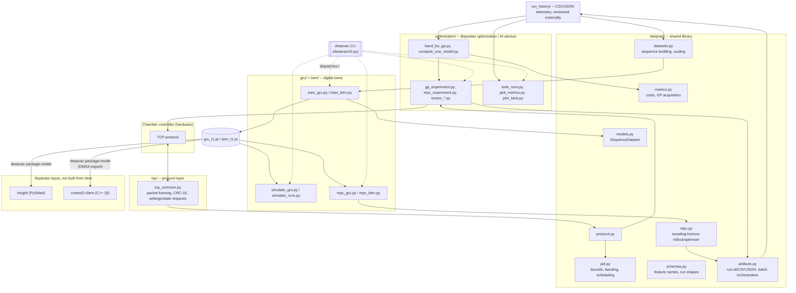

# Deepvac Foresight

Research and engineering toolkit for temperature control of a vacuum chamber.
It communicates to a chamber controller over a TCP protocol, records
temperature/PID telemetry, searches for better PID gains with Gaussian-process
Bayesian optimization, and trains GRU/LSTM neural "digital twins" for offline
simulation and model-predictive PID selection.

## ⚠️ Safety

This toolkit can write PID coefficients directly to a real chamber
controller over an **unauthenticated, unencrypted** TCP connection
(`tcp/tcp_common.py`). **`--tcp-host`/`--tcp-port` There is no
independent supervisory interlock, confirmation prompt, or emergency stop
built into any of them.

- `optimization/mpc_experiment.py`, `gp_experiment.py`, `tocero_3band.py`,
  `tocero_5band.py`, `tocero_gp_mpc.py`, `random_pid_tests.py`, and
  `training_loop.py` all write PID values over TCP. `tocero_gp_mpc.py` accepts
  `--dry-run` to exercise its full schedule without writing anything.
- Anything under `gru/`, `lstm/`, and `deepvac/mpc.py` that reads
  "simulation"/"MPC scheduler" runs entirely offline against a trained
  neural-network plant model.

## Architecture



**Data flow, in words:** the chamber writes/reads telemetry over
`tcp/tcp_common.py`. `optimization/` runs either write live PID values back to
the chamber (`*_experiment.py`, `tocero_*.py`, `training_loop.py`) or fit GP-BO
models to past runs and suggest new candidates (`band_bo_gp.py`,
`compute_one_model.py`). Every run's samples/summaries land as CSV/JSON under
a `run_history`-style directory. `gru/` and `lstm/` train neural plant models
on that same history, then use the trained checkpoint for pure offline
simulation (`simulate_*.py`) or a receding-horizon MPC scheduler
(`mpc_gru.py` / `mpc_lstm.py`, sharing their rollout/optimizer loop via
`deepvac/mpc.py`). `deepvac/` holds: protocol re-export, PID
bounds/banding, cost/acquisition math, dataset/sequence building, and
run-artifact persistence.

### Package layout

- `deepvac/` -- shared library: `protocol`, `schemas`, `pid`, `metrics`,
  `datasets`, `models`, `mpc`, `artifacts`, and the `deepvac` CLI dispatcher.
- `tcp/` -- chamber TCP protocol codec, transport, and small standalone
  read/write scripts.
- `gru/`, `lstm/` -- GRU/LSTM plant-model training, offline simulation, and
  MPC PID scheduling. Each owns its own `validation_t1/`, `plots_t1/`,
  `mlruns/` output directories (resolved relative to the script's own file
  location, not your working directory). `lstm/lstm.py` + `lstm/predict.py`
  are an older, separate LSTM pipeline (pickle-based bundles, its own feature
  set) kept only for comparison -- the actively maintained pipeline is
  `lstm/train_lstm.py`, which shares `deepvac/datasets.py` with
  `gru/train_gru.py`.
- `optimization/` -- Bayesian optimization / AI advisor, live-chamber replay
  scripts, and run analysis/plotting.

## Installation

Supported interpreter: **Python 3.10** (validated on 3.10.19). Dependencies
are split into four `pip install -e ".[<group>]"` extras with exact lock
files under `requirements/` -- see `requirements/README.md` for the full
breakdown and how to regenerate them.

```powershell
$env:PYTHONNOUSERSITE = "1"
conda env create -f environment.yml     # full dev environment (all extras)
conda activate deepvac
python -m pip check
```

Or, without conda, pick just the extra you need:

```powershell
python -m pip install -e ".[runtime]" -r requirements\runtime.lock.txt        # chamber control + inference only
python -m pip install -e ".[training]" -r requirements\training.lock.txt      # + training, optuna, mlflow
python -m pip install -e ".[visualization]" -r requirements\visualization.lock.txt  # plotting only, no torch
python -m pip install -e ".[package]" -r requirements\package.lock.txt        # + deepvac package-model (ONNX export)
```

The default PyPI `torch` wheel (pinned in `requirements/runtime.lock.txt`) is
CPU-only and portable. For CUDA, install the matching PyTorch wheel for your
driver from the [official PyTorch installation selector](https://pytorch.org/get-started/locally/)
*before* installing this project's `runtime`/`training` extra, so pip doesn't
overwrite it with the CPU build.

## Unified CLI

One entry point, `deepvac`, dispatches to every script below (it forwards
whatever flags you pass through to that script's own argument parser
unchanged -- `deepvac train-gru --help` is identical to
`python -m gru.train_gru --help`):

```powershell
deepvac --list                 # every subcommand with a one-line description
deepvac train-gru --help
deepvac mpc-lstm --checkpoint lstm\validation_t1\lstm_t1.pt --cpu --duration-s 600
deepvac package-model --checkpoint gru\validation_t1\gru_t1.pt
```

Running scripts directly as modules (`python -m gru.train_gru --help`) still
works identically and is what the examples below use, since it makes the
underlying package explicit.

## Dataset / run schema

Every run (physical, from `optimization/`, or simulated, from `gru/`/`lstm/`)
is a directory of CSV/JSON files. The common columns, defined once in
`deepvac/schemas.py` and `deepvac/datasets.py`:

| Column | Meaning |
|---|---|
| `timestamp` / `elapsed_s` | Physical runs log `timestamp` (unix seconds); offline runs log `elapsed_s` (seconds since run start). `deepvac.datasets.infer_elapsed_s` derives one from the other. |
| `temp` | Measured chamber temperature (°C). |
| `temp_ref` | Target/setpoint temperature (°C). |
| `kp`, `ki`, `kd` | Active PID coefficients for that sample. |
| `temp_u`, `temp_u_p`, `temp_u_i`, `temp_u_d` | Controller output and P/I/D terms (features 4-7 of `deepvac.schemas.DEFAULT_FEATURE_NAMES`, the GRU/LSTM plant-model input). |
| `error` | `temp_ref - temp`, derived if not present. |

A trained checkpoint (`gru_t1.pt` / `lstm_t1.pt`) is a `torch.save` dict with
`model_state_dict`, `x_scaler`/`y_scaler` (fitted `StandardScaler`s),
`feature_names`, and `window_steps` -- see `gru/gru_common.py:load_model` /
`lstm/mpc_lstm.py:load_model`.

## End-to-end examples

All paths are relative to this `scripts/` directory; run from here so the
package-qualified imports (`python -m gru.train_gru`, not
`python train_gru.py`) resolve deterministically.

### 1. Offline training

```powershell
python -m gru.train_gru --history-root optimization\run_history --window-steps 60 --epochs 50
```
Writes a checkpoint to `gru\validation_t1\gru_t1.pt`, a training-curve plot to
`gru\plots_t1\`, and a `validation_report_t1.json` you should read before
trusting the model for anything downstream.

This trains and selects on a **single step**, while the MPC unrolls the model for
its whole horizon. On the archived reconstruction run that gap costs a factor of
~22 (1-step MAE 0.019 °C vs free-running MAE 0.406 °C, of which 0.284 °C is bias).
`gru\train_gru_rollout.py` closes it:

```powershell
python -m gru.train_gru_rollout --init-from gru\validation_t1\gru_t1.pt --rollout-steps 40 --epochs 40
```

- **Loss over an unrolled rollout.** Gradients flow through an N-step unroll in
  which temperature is fed back from the model's own prediction and the PID/diff
  controller is simulated in-graph, matching `deepvac.mpc.step_state`. Only
  `temp_ref`/`kp`/`ki`/`kd` stay teacher-forced, since those are exogenous.
  `--curriculum-epochs` ramps the unroll from 1 step up to `--rollout-steps`.
- **Selection on rollout error**, not 1-step loss. Both are printed each epoch,
  and the report includes a per-horizon-step drift curve — use it to pick an
  `--mpc-horizon-s` where drift is still smaller than the effect you're resolving.
- **`--split-by pid-config`** keeps runs sharing a PID configuration in one split.
  `--config-key first-triplet` groups by far-band entry gains (57 groups over 205
  runs); under a run-level split **67%** of held-out far-band configurations
  already appear in training, so those test numbers measure interpolation rather
  than the generalization the MPC actually needs. At the whole-trajectory
  granularity (`--config-key triplet-set`, 171 groups) the leak is 19%.

The checkpoint layout is unchanged, so the result drops straight into
`mpc_gru.py`, `mpc_batch.py`, and `simulate_gru.py`.

### 2. Offline simulation (no hardware)

```powershell
python -m gru.simulate_gru --checkpoint gru\validation_t1\gru_t1.pt --history-root optimization\run_history
```
Picks a historical run (or a specific one via `--run-id`) from
`--history-root`, replays it in closed loop through the trained GRU +
`ChamberPID`, and reports reconstruction error against the real logged
trajectory -- purely offline, safe to run repeatedly. For a from-scratch
scenario (arbitrary start/target temperature, no historical run needed), use
the MPC scheduler's own rollout instead:
`python -m gru.mpc_gru --checkpoint gru\validation_t1\gru_t1.pt --cpu --start-temp 27 --target-temp 0 --duration-s 1200`.

### 3. PID recommendation (Bayesian optimization, offline)

```powershell
python -m optimization.band_bo_gp --history-root optimization\run_history
```
Fits far/mid/near GP models to `run_history/` and writes suggested next PID
candidates to `optimization\output\band_bo_next_params.json` -- this only
*suggests* values, it does not write anything to the chamber.

`--band-mode 5` fits the five-band layout instead
(`very_far`/`far`/`mid`/`near`/`very_near`), matching
`optimization\tocero_5band.py`:

```powershell
python -m optimization.band_bo_gp --band-mode 5 --history-root optimization\history_5_bands
```

The analysis band boundaries must line up with the runner's crossings, or a
band's samples get attributed to the wrong PID triplet. The defaults already
match (`10,3` for 3 bands, `12,8,5,1` for 5); if you change the runner's
`--cross-band-N` values, pass the same numbers to `--band-thresholds`.

Either mode writes a ready-to-paste `PID_SCHEDULES` block to
`optimization\output\band_bo_candidate_combinations.txt` -- 9-wide tuples for
`tocero_3band.py`, 15-wide for `tocero_5band.py`. Paste it into the matching
runner's `PID_SCHEDULES` to execute the suggestions, then re-run the fit.
`optimization\training_loop.py` automates that cycle for 3 bands only.

### 4. Two-phase live control: GP far band, then GRU+MPC (writes to the chamber)

```powershell
python -m optimization.tocero_gp_mpc --duration-s 1800 --target-temp 0 --far-band 10 --mpc-hold-s 5 --dry-run
```
A single far band: while `abs(temp - target) > --far-band` the run holds one PID
triplet chosen by the far-band GP from `--gp-history-root`. From the first sample
inside the band, the GRU plant model plus MPC re-infer the PID every
`--mpc-hold-s` seconds and write each decision to the chamber. Drop `--dry-run`
to actually drive the chamber.

MPC decisions are scored with `deepvac/mpc_batch.py`, which evaluates the whole
candidate population in one batched GRU forward. The scalar `deepvac/mpc.py` path
costs ~281 s for a default CEM decision on CPU and cannot hold a 5 s cadence;
batched, the same decision is ~3-4 s. If a decision still overruns, CEM stops
early at `--mpc-time-budget-s` (default 60% of the hold) and the run reports
`mpc_overruns`. `--mpc-hold-s` should be a whole multiple of `--dt-s`, since
decisions can only fire on a sampling tick.


### 5. Zero-overshoot PID search (writes to the chamber)

```powershell
python -m optimization.collect_runs --knots 4 --n-configs 6 --repeats 4 --dry-run
python -m optimization.settling_metrics --history-root run_history_profiles
```

`collect_runs.py` drives each run from a **time-indexed PID profile**: K knots
spread over `--profile-span-s`, re-evaluated and written every
`--update-interval-s` (3 s). `--knots 1` is a single fixed triplet, so "one fixed
set" and "changing continuously" are the same code path. `--profile-mode linear`
ramps between knots, which avoids the control discontinuity an abrupt kp change
causes (`p_part = error/kp` and `d_part = (kd/kp)*(-diff)` rescale instantly while
`i_part` carries over); `step` is the abrupt comparison. It logs **every phase
including the reheat**, and gates the test start on temperature *and* drift rate so
repeats share an initial condition.

`settling_metrics.py` splits each run into setpoint episodes and scores four
things separately rather than as `tail_mae + 10*overshoot^2`: transient overshoot,
steady jitter, steady bias, and settling time. Configurations are ranked
zero-overshoot first, then by jitter and bias; nothing is dropped, so near misses
stay visible. Across replicates, overshoot is summarised by its **worst** run,
since zero overshoot is a hard requirement.

Two numbers worth knowing before running a campaign. The logged temperature is
quantised at ~0.044 °C, so "zero overshoot" can only mean "within one sensor
count" (`--overshoot-tol` defaults to 0.05). And transient overshoot has a
within-configuration SD of ~0.1 °C against a between-configuration SD of
~0.14 °C, so a single run cannot rank two profiles — hence `--repeats 4`, whereas
jitter and bias (SNR ~7-16) are fine from one run.

## Packaging a model for the desktop apps

`deepvac package-model` (`deepvac/packaging.py`) stages a trained checkpoint
for both downstream desktop apps into a local `packaging/` folder -- it never
writes into either app's checkout directly. Requires the `package` extra
(`pip install -e ".[package]" -r requirements\package.lock.txt`).

```powershell
deepvac package-model --checkpoint gru\validation_t1\gru_t1.pt
```

Every run stages both outputs side by side, ready to move by hand:

```
packaging/
  insight/            -> copy into <insight checkout>/app/model/
    model.pt
    simulation.py
  control2-client/    -> copy into <control2-client checkout>/data/model/
    {gru,lstm}_plant_model.onnx
    {gru,lstm}_plant_model.json
```

- **`insight`** (PySide6): stages `model.pt` plus a regenerated
  `simulation.py` whose shared plant-model block is regenerated from this
  repo's `deepvac/mpc.py` + the checkpoint's model class (everything above
  the `# === END GENERATED ===` marker). `--insight-root` (default
  `<root>/deepvac/insight`) is only ever **read** -- it's how the Simulator
  view's hand-maintained logic below that marker (`simulate_candidate`,
  `compute_metrics`) gets carried forward into the newly generated file.
  Pass `--skip insight` to opt out of needing that checkout at all.
- **`control2-client`** (C++ Qt): that app has no ONNX Runtime or LibTorch
  linked yet, so this exports a self-contained ONNX graph -- scaling is
  baked in, so the C++ side feeds a raw feature window and reads back a raw
  temperature delta (°C) with no need to reimplement the checkpoint's
  `StandardScaler`. `deepvac package-model` verifies the exported graph
  numerically against the original PyTorch model before reporting success
  (pass `--no-verify-onnx` to skip).

Model types are registered in `deepvac/model_registry.py` (currently `gru`,
`lstm`); `--model-type` is only needed to override the default resolution
order: the checkpoint's own stamped `model_family` field first, then
(for older checkpoints saved before that field existed) whichever
registered type name appears as a path component. Use `--latest DIR`
instead of `--checkpoint` to auto-pick the newest `*.pt` under a directory.
`--output-dir` overrides where `packaging/` is created (default: current
directory).
