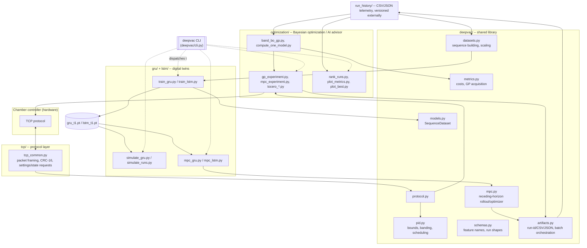

# Deepvac

Research and engineering toolkit for temperature control of a vacuum chamber.
It talks to a chamber controller over a proprietary TCP protocol, records
temperature/PID telemetry, searches for better PID gains with Gaussian-process
Bayesian optimization, and trains GRU/LSTM neural "digital twins" for offline
simulation and model-predictive PID selection.

> **This is not the operator dashboard.** The Flask/desktop visualization
> application that used to live in this repository has moved to a separate
> `deepvac-insight` app and is intentionally not part of this package.

## ⚠️ Safety

This toolkit can write PID coefficients directly to a real chamber
controller over an **unauthenticated, unencrypted** TCP connection
(`tcp/tcp_common.py`). **`--tcp-host`/`--tcp-port` default to a real
controller address hard-coded in `tcp/tcp_common.py:7-8`
(`DEFAULT_HOST = "172.0.30.10"`), so running any of these scripts with no
`--tcp-host` override targets real hardware by default.** There is no
independent supervisory interlock, confirmation prompt, or emergency stop
built into any of them.

- `optimization/mpc_experiment.py`, `gp_experiment.py`, `tocero_3band.py`,
  `tocero_5band.py`, `random_pid_tests.py`, and `training_loop.py` all write
  PID values over TCP and have **no `--dry-run` flag** -- the only way to
  preview what they would send is to read the script's PID-selection logic
  and the run's PID bounds flags yourself before running it.
  `optimization/batch_gp_experiment.py` is the one exception and does
  support `--dry-run` (prints the planned per-scenario commands without
  running them).
- Anything under `gru/`, `lstm/`, and `deepvac/mpc.py` that reads
  "simulation"/"MPC scheduler" runs entirely offline against a trained
  neural-network plant model -- it never touches the chamber. It is safe to
  run repeatedly.
- Before any live run: pass an explicit `--tcp-host` you have verified,
  confirm PID bounds are sane for your hardware, and have a way to
  physically intervene.
- There is no automated pass/fail gate on a trained model before it's used to
  pick live PID values -- validate a checkpoint's `validation_report*.json`
  yourself first.

## Architecture



**Data flow, in words:** the chamber writes/reads telemetry over
`tcp/tcp_common.py`. `optimization/` runs either write live PID values back to
the chamber (`*_experiment.py`, `tocero_*.py`, `training_loop.py`) or fit GP-BO
models to past runs and suggest new candidates (`band_bo_gp.py`,
`compute_one_model.py`). Every run's samples/summaries land as CSV/JSON under
a `run_history`-style directory. `gru/` and `lstm/` train neural plant models
on that same history, then use the trained checkpoint for pure offline
simulation (`simulate_*.py`) or a receding-horizon MPC scheduler
(`mpc_gru.py` / `mpc_lstm.py`, sharing their rollout/optimizer loop via
`deepvac/mpc.py`). `deepvac/` holds everything that used to be duplicated or
inconsistently imported between those packages: protocol re-export, PID
bounds/banding, cost/acquisition math, dataset/sequence building, and
run-artifact persistence.

### Package layout

- `deepvac/` -- shared library: `protocol`, `schemas`, `pid`, `metrics`,
  `datasets`, `models`, `mpc`, `artifacts`, and the `deepvac` CLI dispatcher.
- `tcp/` -- chamber TCP protocol codec, transport, and small standalone
  read/write scripts.
- `gru/`, `lstm/` -- GRU/LSTM plant-model training, offline simulation, and
  MPC PID scheduling. Each owns its own `validation_t1/`, `plots_t1/`,
  `mlruns/` output directories (resolved relative to the script's own file
  location, not your working directory). `lstm/lstm.py` + `lstm/predict.py`
  are an older, separate LSTM pipeline (pickle-based bundles, its own feature
  set) kept only for comparison -- the actively maintained pipeline is
  `lstm/train_lstm.py`, which shares `deepvac/datasets.py` with
  `gru/train_gru.py`.
- `optimization/` -- Bayesian optimization / AI advisor, live-chamber replay
  scripts, and run analysis/plotting.
- `build/gp_runtime/` -- a separately maintained snapshot used to
  PyInstaller-build a standalone `DeepvacAIAdvisor.exe`. It is **not**
  synced from the packages above and is out of scope for this refactor,
  same as the separate visualization app.

## Installation

Supported interpreter: **Python 3.10** (validated on 3.10.19). Dependencies
are split into four `pip install -e ".[<group>]"` extras with exact lock
files under `requirements/` -- see `requirements/README.md` for the full
breakdown and how to regenerate them.

```powershell
$env:PYTHONNOUSERSITE = "1"
conda env create -f environment.yml     # full dev environment (all extras)
conda activate deepvac
python -m pip check
```

Or, without conda, pick just the extra you need:

```powershell
python -m pip install -e ".[runtime]" -r requirements\runtime.lock.txt        # chamber control + inference only
python -m pip install -e ".[training]" -r requirements\training.lock.txt      # + training, optuna, mlflow
python -m pip install -e ".[visualization]" -r requirements\visualization.lock.txt  # plotting only, no torch
```

The default PyPI `torch` wheel (pinned in `requirements/runtime.lock.txt`) is
CPU-only and portable. For CUDA, install the matching PyTorch wheel for your
driver from the [official PyTorch installation selector](https://pytorch.org/get-started/locally/)
*before* installing this project's `runtime`/`training` extra, so pip doesn't
overwrite it with the CPU build.

`PYTHONNOUSERSITE=1` prevents packages in the per-user Python directory from
overriding packages installed in the Conda environment.

## Unified CLI

One entry point, `deepvac`, dispatches to every script below (it forwards
whatever flags you pass through to that script's own argument parser
unchanged -- `deepvac train-gru --help` is identical to
`python -m gru.train_gru --help`):

```powershell
deepvac --list                 # every subcommand with a one-line description
deepvac train-gru --help
deepvac mpc-lstm --checkpoint lstm\validation_t1\lstm_t1.pt --cpu --duration-s 600
```

Running scripts directly as modules (`python -m gru.train_gru --help`) still
works identically and is what the examples below use, since it makes the
underlying package explicit.

## Dataset / run schema

Every run (physical, from `optimization/`, or simulated, from `gru/`/`lstm/`)
is a directory of CSV/JSON files. The common columns, defined once in
`deepvac/schemas.py` and `deepvac/datasets.py`:

| Column | Meaning |
|---|---|
| `timestamp` / `elapsed_s` | Physical runs log `timestamp` (unix seconds); offline runs log `elapsed_s` (seconds since run start). `deepvac.datasets.infer_elapsed_s` derives one from the other. |
| `temp` | Measured chamber temperature (°C). |
| `temp_ref` | Target/setpoint temperature (°C). |
| `kp`, `ki`, `kd` | Active PID coefficients for that sample. |
| `temp_u`, `temp_u_p`, `temp_u_i`, `temp_u_d` | Controller output and P/I/D terms (features 4-7 of `deepvac.schemas.DEFAULT_FEATURE_NAMES`, the GRU/LSTM plant-model input). |
| `error` | `temp_ref - temp`, derived if not present. |

A trained checkpoint (`gru_t1.pt` / `lstm_t1.pt`) is a `torch.save` dict with
`model_state_dict`, `x_scaler`/`y_scaler` (fitted `StandardScaler`s),
`feature_names`, and `window_steps` -- see `gru/gru_common.py:load_model` /
`lstm/mpc_lstm.py:load_model`.

## End-to-end examples

All paths are relative to this `scripts/` directory; run from here so the
package-qualified imports (`python -m gru.train_gru`, not
`python train_gru.py`) resolve deterministically.

### 1. Offline training

```powershell
python -m gru.train_gru --history-root optimization\run_history --window-steps 60 --epochs 50
```
Writes a checkpoint to `gru\validation_t1\gru_t1.pt`, a training-curve plot to
`gru\plots_t1\`, and a `validation_report_t1.json` you should read before
trusting the model for anything downstream.

### 2. Offline simulation (no hardware)

```powershell
python -m gru.simulate_gru --checkpoint gru\validation_t1\gru_t1.pt --history-root optimization\run_history
```
Picks a historical run (or a specific one via `--run-id`) from
`--history-root`, replays it in closed loop through the trained GRU +
`ChamberPID`, and reports reconstruction error against the real logged
trajectory -- purely offline, safe to run repeatedly. For a from-scratch
scenario (arbitrary start/target temperature, no historical run needed), use
the MPC scheduler's own rollout instead:
`python -m gru.mpc_gru --checkpoint gru\validation_t1\gru_t1.pt --cpu --start-temp 27 --target-temp 0 --duration-s 1200`.

### 3. PID recommendation (Bayesian optimization, offline)

```powershell
python -m optimization.band_bo_gp --history-root optimization\run_history
```
Fits far/mid/near GP models to `run_history/` and writes suggested next PID
candidates to `optimization\output\band_bo_next_params.json` -- this only
*suggests* values, it does not write anything to the chamber.

### 4. Guarded live validation (writes to real hardware)

Read the [Safety](#️-safety) section above first -- `mpc_experiment.py` has
no `--dry-run`, so "guarded" here means reviewing the decisions CSV and PID
bounds yourself before running it, and always passing an explicit,
verified `--tcp-host`:

```powershell
python -m optimization.mpc_experiment --decisions-csv gru\mpc_pid_runs\<run_id>\mpc_decisions.csv --tcp-host <verified-controller-ip> --tcp-port 4321 --pid-row 0
```

If you only want to see what a batch of scenarios *would* run without
sending anything, `batch_gp_experiment.py` supports `--dry-run`:

```powershell
python -m optimization.batch_gp_experiment --dry-run
```

## Known gaps

No automated test suite, CI, or model-acceptance gate exists yet (see
`pyproject.toml`'s `[tool.pytest.ini_options]`, which is configured for a
`tests/` directory that doesn't exist). Trained models, run histories, and
plots are tracked as regular files rather than in an external artifact store.
Treat this as an expert-operated experimental toolkit, not an autonomous
production controller.
